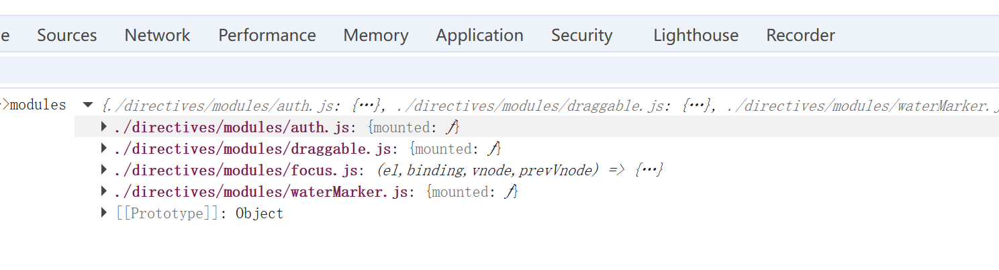
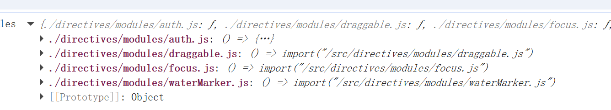
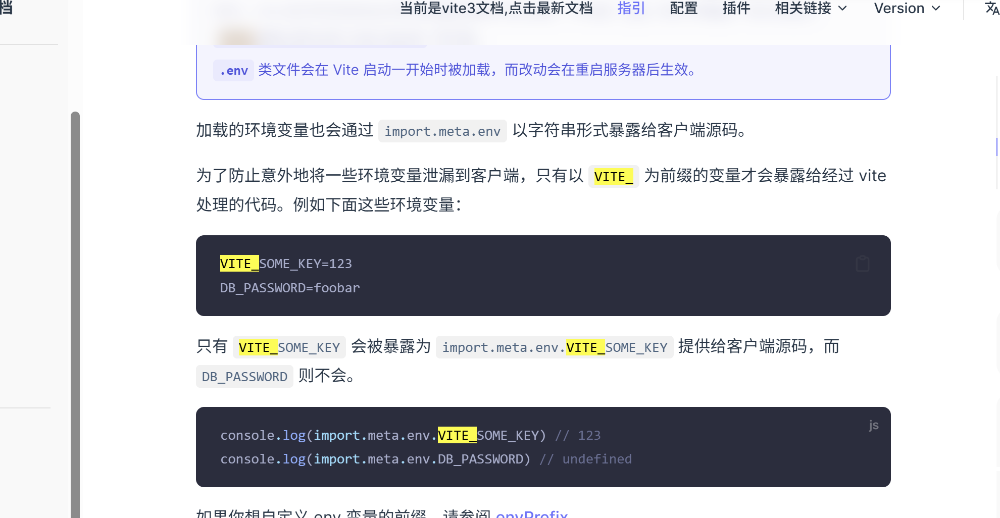
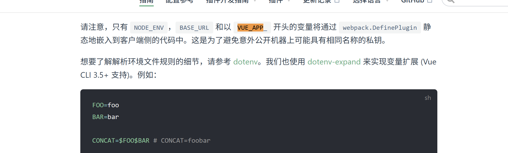
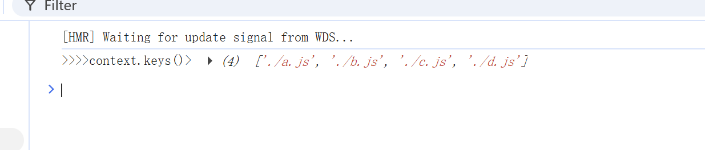
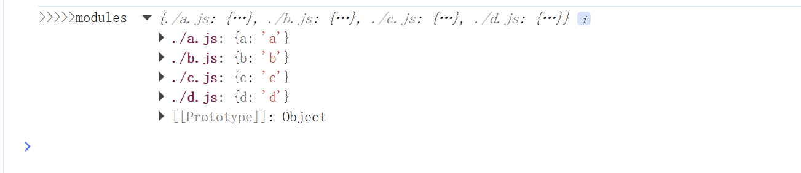
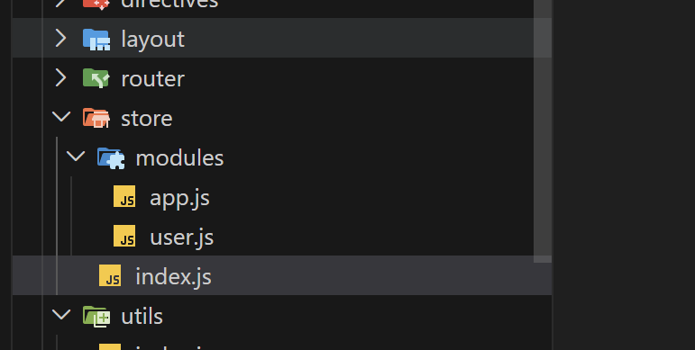

## 清理浏览器样式

1.  下载安装

```sh
npm install normalize.css
```

2.  创建目录 `src/global.css`

```scss
@import "normalize.css";
```

3.  在`main.js`中引入 `normalize.scss`

```js
import "./global.css";
```

## sass支持

```sh
npm install sass -D
```

## 安装elemement-plus

1. 下载安装

```sh
 npm install element-plus --save
```

```sh
https://element-plus.org/zh-CN/
```

2. 修改样式 深度选择器

```scss
::v-deep(.el-element);
```

## 跨域（同协议同域名同端口）解决方案

1. jsonp
   > 缺点 ：只能解决GET请求，其余不支持
   > 原理：借助script标签的src属性，通过script标签/img标签的src属性向服务器发送请求，后端接口需要配合把数据通过一个函数包裹传递回来
2. Proxy 配置代理
   > 代理服务器实现跨域请求，服务器之间发生请求无跨域
3. CORS（Access-Control-Allow-Origin） 跨域资源共享
   > 后端开启即可

## axios封装

#### 封装好处

1. 避免重复编写代码
   - 请求基准地址 （baseUrl）

## 菜单数据结构

```json
    {
        "id": 1, // 菜单Id
        "createTime": "2023-04-26 22:46:59",
        "updateTime": "2023-04-26 22:47:11",
        "parentId": null, // 父级Id
        "name": "Dashboard", // 菜单名称
        "router": null,  // 路由
        "perms": null,  // 权限
        "type": 0,   // 0:目录 1:菜单 2:按钮
        "icon": "House",  // 图标
        "orderNum": 1,  // 排序
        "viewPath": null,  // 菜单路径
        "keepAlive": 1, // 是否缓存
        "isShow": 1,// 是否显示
    },
```

## 菜单权限

1.  将后端返回的menus菜单数据进行树形化，根据element-plus 的el-menu菜单组件封装递归的菜单组件，过滤掉type:0目录，type:1菜单，type:2的按钮

## 路由权限

#### 1. 跳转路由前判断是否有路由的访问权限，

#### 2. 全局前置守卫中判断访问的路由是否在用户的路由集合中

#### 3. 动态添加路由

1.  知识点：router.addRoute()
    - 语法一 : addRoute(parentRoute父路由,route子路由) 在父路由下添加子路由

    ```js
    addRoute("login", {
      path: "/1111",
      name: "1111",
      component: () => import("@/views/login/1111.vue"),
    });
    ```

    - 语法二 : addRoute(route子路由) 添加一级路由

    ```js
    addRoute({
      path: "/1111",
      name: "1111",
      component: () => import("@/views/login/1111.vue"),
    });
    ```

2.  知识点：router.hasRoute()

- 返回布尔值 hasRoute(name)

3.  知识点：router.removeRoute()只能通过路由名称name属性值判断是否存在

- 语法： removeRoute(name)只能通过路由名称name属性值移除

4. vueRouter@4之前有addRoutes()的方法可以动态添加多个路由，4版本移除了
5. 静态路由：不需要权限控制的路由
6. 动态路由(异步路由)：需要权限控制的路由，使用addRoute添加的路由

## 自定义指令

1. 全局注册

- 语法：在main.js中：app.directive('focus',focus) , 使用v-focus

2. 局部注册:

- 组合式setup语法：

  ```html
  <template>
    <div>
      <h2>自定义指令</h2>
      <input type="text" v-my-directive />
    </div>
  </template>
  <script setup>
    import myDirective from "../../directives/focus.js";
    const vMyDirective = myDirective;
  </script>
  ```

  - 选项式语法：直接引入自定义指令文件
    directsives: {myDirective:myDirective}

## 动态导入多个模块

#### 1.vite

```js
import.meta.glob();
```

1.  源码地址 https://vitejs.cn/vite3-cn/guide/features.html#glob-import
2.  示例 directives/modules/index.js router/index.js

```js
const modules = import.meta.glob("./directives/modules/*.js", {
  // 开启同步导入 value的值是一个Module对象
  eager: true,
  //  default:默认导出的是文件的内容  mounted(el,bingding){ .../ }=>module对象导出的内容
  //  import: 'default'   不启用default就是modules对象
});
console.log(">>>>>modules", modules);
```

3.  开启同步导入得到：

```js
const modules = import.meta.glob("./modules/*.js", {
  eager: true,
  import: "default",
}); // 相当于 c 导出auth
```

- 用于批量导入 ：代替重复的：import auth from './modules/auth' 在directives/index.js场景中体现

4.  默认不开启得到：

```js
const modules = import.meta.glob("./modules/*.js");
或;
// 动态导入组件模块        /**/表示深层搜索
const modules = import.meta.glob("../views/**/*.vue", { eager: false });
```

- 用于动态匹配组织，动态导入路由 component: modules[`../${item.viewPath}`], 在router/index.js场景中体现，解决动态导入路由在产品环境后找不到文件问题，因为路径

#### 2.webpack

```js
require.context();
const context = require.context("./modules/", false, /\.js$/, "sync");
let modules = {};
context.keys().forEach((key) => {
  const module = context(key);
  modules[key] = module.default;
});
```

## 环境文件导入

#### vite

https://vitejs.cn/vite3-cn/guide/env-and-mode.html#env-files


1.  一级目录创建 .env.development.local .env.production.local .env.test.local ...
2.  写入环境变量 VITE*APP_BASE_URL=/api/ 必须VITE*前缀
3.  读取环境变量 import.meta.env.VITE_APP_BASE_URL

#### cli

https://cli.vuejs.org/zh/guide/mode-and-env.html#%E7%8E%AF%E5%A2%83%E5%8F%98%E9%87%8F


```js
console.log(">>>>>当前环境process.env.NODE_ENV", process.env.NODE_ENV); // development/production
console.log(
  ">>>>>当前环境变量process.env.VUE_APP_API",
  process.env.VUE_APP_API,
); // VUE_APP前缀
```

## 安装vue2-demo

1.  安装旧版vue/cli脚手架 npm install -g @vue/cli@4.5.19
2.  检查版本 vue -V
3.  创建项目 vue create vue2-demo

```js
// 动态导入多个模块文件
const context = require.context("./modules", false, /\.js$/, "sync");
console.log(">>>>context.keys()>", context.keys());
let modules = {};
context.keys().forEach((key) => {
  const module = context(key);
  modules[key] = module.default;
});
console.log(">>>>>modules", modules);
```




#### vuex状态管理

1. 目录结构
   
2. 下载并引入

- npm install vuex
- 在main.js中引入

```js
import store from "./store";
createApp(App).use(store).mount("#app");
```

3. 创建仓库 modules/app.js文件

```js
export default {
  namespaced: true,
  state: {
    collapsed: false,
  },
  mutations: {
    setCollapsed(state, payload) {
      state.collapsed = payload;
    },
  },
  actions: {
    changeCollpased({ commit }, payload) {
      commit("setCollapsed", payload);
    },
  },
};
```

3. 使用vuex仓库的modules,index.js文件

```js
import { createStore } from "vuex";
import user from "./modules/user";
import app from "./modules/app";
const store = createStore({
  modules: {
    user,
    app,
  },
});
export default store;
```

#### pinia状态管理（仓库） https://pinia.vuejs.org/zh/introduction.html

##### 与vuex对比

1. 与vuex一样有store，且可以有多个

- vuex只有一个stor，要拆分store通过module配置
- pinia可以有多个store，无需拆分store

2. vuex有一个核心配置mutations，pinia没有
3. vue3需要使用vuex4版本，pinia可以看出是vuex5
4. 总结官方

- mutation 已被弃用。它们经常被认为是极其冗余的。它们初衷是带来 devtools 的集成方案，但这已不再是一个问题了。
- 对TypeScript支持更好，Vue3底层源码是TypeScript重写的。pinia也是(无需要创建自定义的复杂包装器来支持 TypeScript，一切都可标注类型，API 的设计方式是尽可能地利用 TS 类型推理。)
- 无过多的魔法字符串注入，只需要导入函数并调用它们，然后享受自动补全的乐趣就好。
- 使用到才会加载(无需要动态添加 Store，它们默认都是动态的，甚至你可能都不会注意到这点。注意，你仍然可以在任何时候手动使用一个 Store 来注册它，但因为它是自动的，所以你不需要担心它。)
- 不再有嵌套结构的模块。你仍然可以通过导入和使用另一个 Store 来隐含地嵌套 stores 空间。虽然 Pinia 从设计上提供的是一个扁平的结构，但仍然能够在 Store 之间进行交叉组合。你甚至可以让 Stores 有循环依赖关系
- 不再有可命名的模块。考虑到 Store 的扁平架构，Store 的命名取决于它们的定义方式，你甚至可以说所有 Store 都应该命名。

5. 自己总结

- 两个都是vue的插件，实现全局状态共享
- pinia只能用于vue3项目，vuex@4可以用于vue3，vue2项目只能使用vuex@4以下
- vuex中要mutation，pinia去掉该配置了
- vuex中只有一个store，pinia中可以有多个store，pinia移除了modules配置
- pinia对TS支持更友好，提供大量的语法支持，避免魔法字符串的使用

#### pinia起步

1. 安装pinia

```sh
npm istall pinia
```

2. 创建store

```ts
import { defineStore } from "pinia";
export const useCounterStore = defineStore("counter", {
  // 配置
});
```

3. 入口main文件中引入store，注册

```ts
import { createApp } from "vue";
const pinia = createPinia();
createApp(App).use(pinia).mount("#app");
```

4. 创建store的两种方式

- compositon api函数式

```ts
// 函数式创建store
import { defineStore } from "pinia";
import { ref, computed } from "vue";
export const useApp = defineStore("app", () => {
  const count = ref<number>(0);
  const double = computed(() => count.value * 2);
  function increment() {
    count.value++;
  }
  function decrement() {
    count.value--;
  }
  return {
    count,
    double,
    decrement,
    increment,
  };
});
```

- options选项式

```ts
import { defineStore } from "pinia";
// 返回的是一个组合式函数
export const useApp = defineStore("app", {
  state: () => {
    return {
      isLoading: false,
      msg: "hellow",
    };
  },
  // 计算属性
  getters: {
    reverseMsg: (state) => {
      return state.msg.split("").reverse().join("");
    },
  },
  actions: {
    changeMsg(msg: string) {
      // this获取store实例
      this.msg = msg;
    },
    setLoading(isLoading: boolean) {
      this.isLoading = isLoading;
    },
  },
});
```

5. 使用

```html
<template>
  <div>
    <h1>app</h1>
    <button @click="handleTest">测试</button>
    <p>{{ app.msg }}</p>
    <p>{{ app.reverseMsg }}</p>
    <p><button @click="app.changeMsg('历史')">修改msg</button></p>
  </div>
</template>
<script setup lang="ts">
  import { ref } from "vue";
  import request from "@/utils/request";
  import { useApp } from "@/stores/app";
  const app = useApp();

  const handleTest = () => {
    console.log("test");
    request.get("/test").then((res) => {
      console.log(res);
    });
  };
</script>
```

##### pinia的插件 pinia-plugin-persistedstate持久化插件

1. 安装

```bash
npm i pinia-plugin-persistedstate
```

2. 配置使用

```ts
import { createPinia } from "pinia";
import piniaPlusPersistedState from "pinia-plugin-persisted-state";
const pinia = createPinia();
pinia.use(piniaPlusPersistedState);
```

- 配置持久化

```ts
persist: true;
```

- 配置持久化的key

```ts
persist: {
    // paths: ["msg"],
    // exclude: ["isLoading"],
    // storage:localStorage,
    storage: sessionStorage,
  }
```
