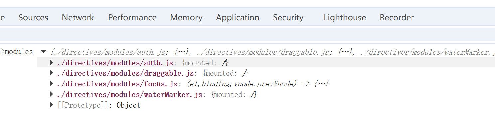
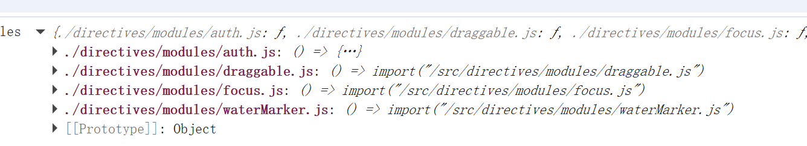
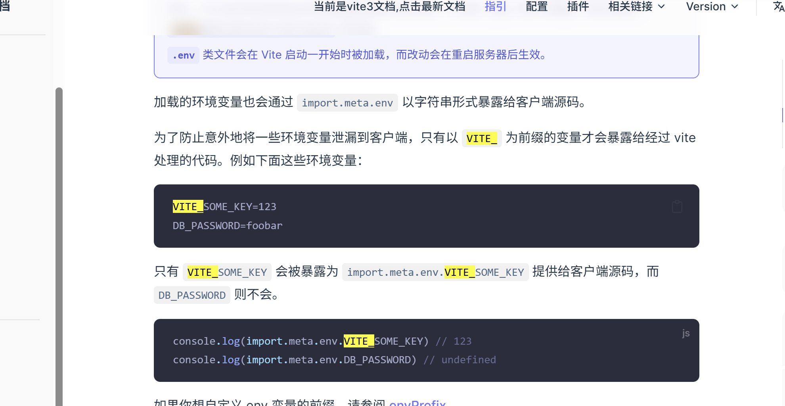
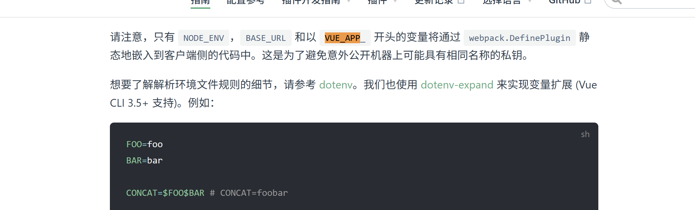
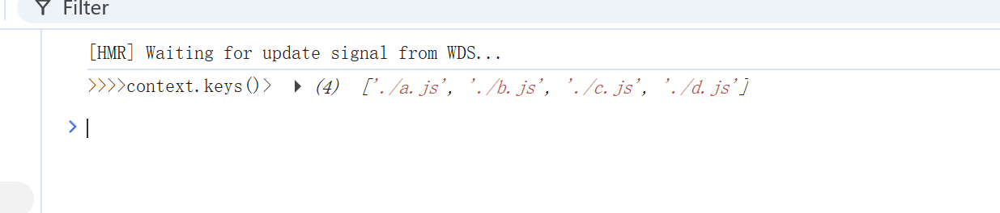
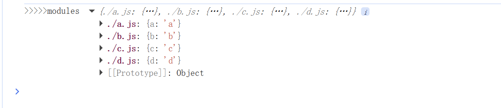
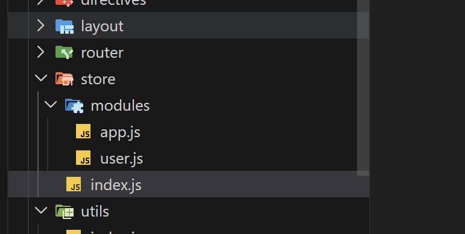
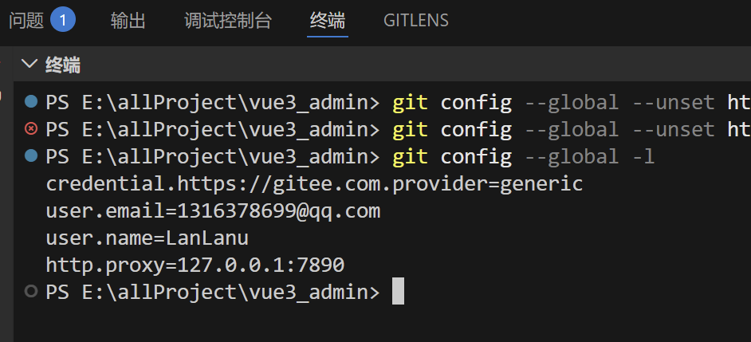

## 参考项目 https://show.cool-admin.com/

#### 前端地址 git clone https://github.com/cool-team-official/cool-admin-vue.git

```bash
git clone https://gitee.com/cool-team-official/cool-admin-vue.git
```

#### 后端地址 git clone https://github.com/cool-team-official/cool-admin-midway.git

## 清理浏览器样式

1.  下载安装

```sh
npm install normalize.css
```

2.  创建目录 `src/global.css`

```scss
@import "normalize.css";
```

3.  在`main.js`中引入 `normalize.scss`

```js
import "./global.css";
```

## sass支持

```sh
npm install sass -D
```

## 安装elemement-plus

1. 下载安装

```sh
 npm install element-plus --save
```

```sh
https://element-plus.org/zh-CN/
```

2. 修改样式 深度选择器

```scss
::v-deep(.el-element);
```

## 跨域（同协议同域名同端口）解决方案

1. jsonp
   > 缺点 ：只能解决GET请求，其余不支持
   > 原理：借助script标签的src属性，通过script标签/img标签的src属性向服务器发送请求，后端接口需要配合把数据通过一个函数包裹传递回来
2. Proxy 配置代理
   > 代理服务器实现跨域请求，服务器之间发生请求无跨域
3. CORS（Access-Control-Allow-Origin） 跨域资源共享
   > 后端开启即可

## axios封装

#### 封装好处

1. 避免重复编写代码
   - 请求基准地址 （baseUrl）

## 菜单数据结构

```json
    {
        "id": 1, // 菜单Id
        "createTime": "2023-04-26 22:46:59",
        "updateTime": "2023-04-26 22:47:11",
        "parentId": null, // 父级Id
        "name": "Dashboard", // 菜单名称
        "router": null,  // 路由
        "perms": null,  // 权限
        "type": 0,   // 0:目录 1:菜单 2:按钮
        "icon": "House",  // 图标
        "orderNum": 1,  // 排序
        "viewPath": null,  // 菜单路径
        "keepAlive": 1, // 是否缓存
        "isShow": 1,// 是否显示
    },
```

## 菜单权限

1.  将后端返回的menus菜单数据进行树形化，根据element-plus 的el-menu菜单组件封装递归的菜单组件，过滤掉type:0目录，type:1菜单，type:2的按钮

## 路由权限

#### 1. 跳转路由前判断是否有路由的访问权限，

#### 2. 全局前置守卫中判断访问的路由是否在用户的路由集合中

#### 3. 动态添加路由

1.  知识点：router.addRoute()
    - 语法一 : addRoute(parentRoute父路由,route子路由) 在父路由下添加子路由

    ```js
    addRoute("login", {
      path: "/1111",
      name: "1111",
      component: () => import("@/views/login/1111.vue"),
    });
    ```

    - 语法二 : addRoute(route子路由) 添加一级路由

    ```js
    addRoute({
      path: "/1111",
      name: "1111",
      component: () => import("@/views/login/1111.vue"),
    });
    ```

2.  知识点：router.hasRoute()

- 返回布尔值 hasRoute(name)

3.  知识点：router.removeRoute()只能通过路由名称name属性值判断是否存在

- 语法： removeRoute(name)只能通过路由名称name属性值移除

4. vueRouter@4之前有addRoutes()的方法可以动态添加多个路由，4版本移除了
5. 静态路由：不需要权限控制的路由
6. 动态路由(异步路由)：需要权限控制的路由，使用addRoute添加的路由

## 自定义指令

1. 全局注册

- 语法：在main.js中：app.directive('focus',focus) , 使用v-focus

2. 局部注册:

- 组合式setup语法：

  ```html
  <template>
    <div>
      <h2>自定义指令</h2>
      <input type="text" v-my-directive />
    </div>
  </template>
  <script setup>
    import myDirective from "../../directives/focus.js";
    const vMyDirective = myDirective;
  </script>
  ```

  - 选项式语法：直接引入自定义指令文件
    directsives: {myDirective:myDirective}

## 动态导入多个模块

#### 1.vite

```js
import.meta.glob();
```

1.  源码地址 https://vitejs.cn/vite3-cn/guide/features.html#glob-import
2.  示例 directives/modules/index.js router/index.js

```js
const modules = import.meta.glob("./directives/modules/*.js", {
  // 开启同步导入 value的值是一个Module对象
  eager: true,
  //  default:默认导出的是文件的内容  mounted(el,bingding){ .../ }=>module对象导出的内容
  //  import: 'default'   不启用default就是modules对象
});
console.log(">>>>>modules", modules);
```

3.  开启同步导入得到：

```js
const modules = import.meta.glob("./modules/*.js", {
  eager: true,
  import: "default",
}); // 相当于 c 导出auth
```

- 用于批量导入 ：代替重复的：import auth from './modules/auth' 在directives/index.js场景中体现

4.  默认不开启得到：

```js
const modules = import.meta.glob("./modules/*.js");
或;
// 动态导入组件模块        /**/表示深层搜索
const modules = import.meta.glob("../views/**/*.vue", { eager: false });
```

- 用于动态匹配组织，动态导入路由 component: modules[`../${item.viewPath}`], 在router/index.js场景中体现，解决动态导入路由在产品环境后找不到文件问题，因为路径

#### 2.webpack

```js
require.context();
const context = require.context("./modules/", false, /\.js$/, "sync");
let modules = {};
context.keys().forEach((key) => {
  const module = context(key);
  modules[key] = module.default;
});
```

## 环境文件导入

#### vite

https://vitejs.cn/vite3-cn/guide/env-and-mode.html#env-files


1.  一级目录创建 .env.development.local .env.production.local .env.test.local ...
2.  写入环境变量 VITE*APP_BASE_URL=/api/ 必须VITE*前缀
3.  读取环境变量 import.meta.env.VITE_APP_BASE_URL

#### cli

https://cli.vuejs.org/zh/guide/mode-and-env.html#%E7%8E%AF%E5%A2%83%E5%8F%98%E9%87%8F


```js
console.log(">>>>>当前环境process.env.NODE_ENV", process.env.NODE_ENV); // development/production
console.log(
  ">>>>>当前环境变量process.env.VUE_APP_API",
  process.env.VUE_APP_API,
); // VUE_APP前缀
```

## 安装vue2-demo

1.  安装旧版vue/cli脚手架 npm install -g @vue/cli@4.5.19
2.  检查版本 vue -V
3.  创建项目 vue create vue2-demo

```js
// 动态导入多个模块文件
const context = require.context("./modules", false, /\.js$/, "sync");
console.log(">>>>context.keys()>", context.keys());
let modules = {};
context.keys().forEach((key) => {
  const module = context(key);
  modules[key] = module.default;
});
console.log(">>>>>modules", modules);
```




#### vuex状态管理

1. 目录结构
   
2. 下载并引入

- npm install vuex
- 在main.js中引入

```js
import store from "./store";
createApp(App).use(store).mount("#app");
```

3. 创建仓库 modules/app.js文件

```js
export default {
  namespaced: true,
  state: {
    collapsed: false,
  },
  mutations: {
    setCollapsed(state, payload) {
      state.collapsed = payload;
    },
  },
  actions: {
    changeCollpased({ commit }, payload) {
      commit("setCollapsed", payload);
    },
  },
};
```

3. 使用vuex仓库的modules,index.js文件

```js
import { createStore } from "vuex";
import user from "./modules/user";
import app from "./modules/app";
const store = createStore({
  modules: {
    user,
    app,
  },
});
export default store;
```

#### pinia状态管理（仓库） https://pinia.vuejs.org/zh/introduction.html

##### 与vuex对比

1. 与vuex一样有store，且可以有多个

- vuex只有一个stor，要拆分store通过module配置
- pinia可以有多个store，无需拆分store

2. vuex有一个核心配置mutations，pinia没有
3. vue3需要使用vuex4版本，pinia可以看出是vuex5
4. 总结官方

- mutation 已被弃用。它们经常被认为是极其冗余的。它们初衷是带来 devtools 的集成方案，但这已不再是一个问题了。
- 对TypeScript支持更好，Vue3底层源码是TypeScript重写的。pinia也是(无需要创建自定义的复杂包装器来支持 TypeScript，一切都可标注类型，API 的设计方式是尽可能地利用 TS 类型推理。)
- 无过多的魔法字符串注入，只需要导入函数并调用它们，然后享受自动补全的乐趣就好。
- 使用到才会加载(无需要动态添加 Store，它们默认都是动态的，甚至你可能都不会注意到这点。注意，你仍然可以在任何时候手动使用一个 Store 来注册它，但因为它是自动的，所以你不需要担心它。)
- 不再有嵌套结构的模块。你仍然可以通过导入和使用另一个 Store 来隐含地嵌套 stores 空间。虽然 Pinia 从设计上提供的是一个扁平的结构，但仍然能够在 Store 之间进行交叉组合。你甚至可以让 Stores 有循环依赖关系
- 不再有可命名的模块。考虑到 Store 的扁平架构，Store 的命名取决于它们的定义方式，你甚至可以说所有 Store 都应该命名。

5. 自己总结

- 两个都是vue的插件，实现全局状态共享
- pinia只能用于vue3项目，vuex@4可以用于vue3，vue2项目只能使用vuex@4以下
- vuex中要mutation，pinia去掉该配置了
- vuex中只有一个store，pinia中可以有多个store，pinia移除了modules配置
- pinia对TS支持更友好，提供大量的语法支持，避免魔法字符串的使用

#### pinia起步

1. 安装pinia

```sh
npm istall pinia
```

2. 创建store

```ts
import { defineStore } from "pinia";
export const useCounterStore = defineStore("counter", {
  // 配置
});
```

3. 入口main文件中引入store，注册

```ts
import { createApp } from "vue";
const pinia = createPinia();
createApp(App).use(pinia).mount("#app");
```

4. 创建store的两种方式

- compositon api函数式

```ts
// 函数式创建store
import { defineStore } from "pinia";
import { ref, computed } from "vue";
export const useApp = defineStore("app", () => {
  const count = ref<number>(0);
  const double = computed(() => count.value * 2);
  function increment() {
    count.value++;
  }
  function decrement() {
    count.value--;
  }
  return {
    count,
    double,
    decrement,
    increment,
  };
});
```

- options选项式

```ts
import { defineStore } from "pinia";
// 返回的是一个组合式函数
export const useApp = defineStore("app", {
  state: () => {
    return {
      isLoading: false,
      msg: "hellow",
    };
  },
  // 计算属性
  getters: {
    reverseMsg: (state) => {
      return state.msg.split("").reverse().join("");
    },
  },
  actions: {
    changeMsg(msg: string) {
      // this获取store实例
      this.msg = msg;
    },
    setLoading(isLoading: boolean) {
      this.isLoading = isLoading;
    },
  },
});
```

5. 使用

```html
<template>
  <div>
    <h1>app</h1>
    <button @click="handleTest">测试</button>
    <p>{{ app.msg }}</p>
    <p>{{ app.reverseMsg }}</p>
    <p><button @click="app.changeMsg('历史')">修改msg</button></p>
  </div>
</template>
<script setup lang="ts">
  import { ref } from "vue";
  import request from "@/utils/request";
  import { useApp } from "@/stores/app";
  const app = useApp();

  const handleTest = () => {
    console.log("test");
    request.get("/test").then((res) => {
      console.log(res);
    });
  };
</script>
```

##### pinia的插件 pinia-plugin-persistedstate持久化插件

1. 安装

```bash
npm i pinia-plugin-persistedstate
```

2. 配置使用

```ts
import { createPinia } from "pinia";
import piniaPlusPersistedState from "pinia-plugin-persisted-state";
const pinia = createPinia();
pinia.use(piniaPlusPersistedState);
```

- 配置持久化

```ts
persist: true;
```

- 配置持久化的key

```ts
persist: {
    // paths: ["msg"],
    // exclude: ["isLoading"],
    // storage:localStorage,
    storage: sessionStorage,
  }
```

#### [大文件上传](https://juejin.cn/post/6992508040113029134#heading-11 "相关网站")

#### 上传git有bug

重置

```bash
git config --global --unset https.proxy
git config --global --unset http.proxy
```

查看

```bash
git config --global -l
```



#### 进度条

```bash
npm install nprogress
```

- 使用 router/index.js 路由守卫

```js
import nprogress from "nprogress";
//引入进度条样式
import "nprogress/nprogress.css";
// https://www.npmjs.com/package/nprogress
//全局前置守卫
nprogress.configure({ showSpinner: false });
router.beforeEach(async (to, from) => {
  nprogress.start();
});
//全局后置守卫
router.afterEach(() => {
  nprogress.done();
});
```

#### [后端数据库加表加接口](https://node.cool-admin.com/src/guide/quick.html#%E5%BF%AB%E9%80%9F-crud)

1. 创建表

```js
import { EntityModel } from "@@midwayjs/typeorm";
import { BaseEntity } from "@cool-midway/core";
import { Column } from "typeorm";

/**
 * 商品
 */
@EntityModel("demo_goods")
export class DemoGoodsEntity extends BaseEntity {
  @Column({ comment: "标题" })
  title: string;

  @Column({ comment: "图片" })
  pic: string;

  @Column({ comment: "价格", type: "decimal", precision: 5, scale: 2 })
  price: number;

  @Column({ comment: "分类", type: "tinyint", default: 0 })
  type: number;
}
```

 2. 编写接口

- 文件位置
  

```js
import { DemoGoodsEntity } from "../../entity/goods";
import { BaseController, CoolController } from "@cool-midway/core";
import { DemoGoodsService } from "../../service/goods";

/**
 * 测试
 */
@CoolController({
  api: ["add", "delete", "update", "info", "page", "list"],
  entity: DemoGoodsEntity,
})
export class OpenDemoGoodsController extends BaseController {}
```


- 文件位置
  

## 微信小程序（原生小程序） 2016-9-21内测，2017-1-9正式上线 - 小程序（applet）

1. [文档地址](https://developers.weixin.qq.com/miniprogram/dev/framework/ "开发文档")

2. WebApp 网页应用程序（移动app）HTML + CSS + JS，和网页一套技术
3. NativeApp 本地应用程序（原生app）
4. HybridApp 本地应用程序（混合app）
5. WebView 是移动端系统提供的一个组件，相当于一个内置的迷你浏览器。它没有地址栏、前进后退按钮，只是把浏览器内核封装成控件，嵌入到原生 App 里面，用来加载展示 HTML/CSS/JS 网页。只是一个控件，寄生在原生 App 内部，只负责渲染网页，没有浏览器 UI。

- 显示和渲染网页
- 与页面JavaScript交互，实现混合开发
- 加载网络资源方式：将做好的网页发布网络上传，app直接通过网络地址引入，减少APP体积，APP和网页独立发布
- 加载本地H5资源方式：将本地H5资源合并到APP代码中，打包到APP中

6. DCloud -uniapp-Vue
7. 京东 -Taro-React
8. JS-SDK：解决了移动网页能力不足的问题， 通过暴露微信的接口使得web开发者能够拥有更多的能力
9. 小程序主要的开发语言是JavaScript，网页开发渲染线程和脚本线程是互斥的，小程序是分开的，逻辑层和渲染层是分开的，**缺少相关的DOM的API和BOM的API**，逻辑层是在JScode运行的，渲染层是Chrome WebView,npm的一些包在小程序中是无法运行的，渲染层通过setData(...)（不能超过2MB）操作逻辑层的数据
   
10. [单位rpx](https://developers.weixin.qq.com/miniprogram/dev/framework/view/wxss.html#%E5%B0%BA%E5%AF%B8%E5%8D%95%E4%BD%8D)

- 一个屏幕看成750rpx，
- [类选择器支持](https://developers.weixin.qq.com/miniprogram/dev/framework/view/wxss.html#%E9%80%89%E6%8B%A9%E5%99%A8)
- .class，#id，::after，::before

11. 小程序没有跨越问题
12. 生命周期

- APP(应用)层：onLaunch(options)小程序启动触发，全局共享
- APP(应用)层：onShow(options)监听小程序启动或者切前台
- APP(应用)层：onHide(options)监听小程序切后台
- APP(应用)层：onError监听整个小程序产生错误bug，异常收集上报工作
- APP(应用)层：onPageNotFound打开小程序时的页面，找不到的时候触发-应用场景-活动页（限时的）作为二维码，扫描直接小程序的活动页面，活动过期页面删除，扫码进入触发，可以提示用户活动已经结束然后返回小程序首页
- APP(应用)层：onUnhandledRejection未处理的Promise拒绝事件监听
- APP(应用)层：onThemeChange监听系统主题颜色的变化-需要在app.json中配置`"datakmode":true`
- 页面层：onLoad(options)：页面渲染完毕触发，类似created，options可以拿到URL传递的参数,查询字符串参数`{name:"11",age:14}`
- 页面层：onUnload()：页面卸载触发
- 页面层：onShow(options)：页面切换前台显示触发，scene 场景值
- 页面层：onHide(options)：页面切换后台显示触发，scene 场景值
- 页面层：onReady()：页面初次渲染完毕触发，类似于mounted，scene 场景值
- 页面层：其他
  
  

```js
  onPullDownRefresh(){
    // 下拉刷新
      console.log("下拉刷新");
      wx.stopPullDownRefresh() // 停止
      wx.startPullDownRefresh() // 开启

    },
  onReachBottom(){
    // 应用场景触底刷新列表-上拉加载更多，在json中配置"onReachBottomDistance":100, 距离底部多少触发
    console.log("触底触发");
  },
  /**
   * obj.from:"menu"=>胶囊触发的
   * obj.from:"button"=>按钮触发的 <button type="primary" open-type="share" data-title="震惊了！">分享本页面</button>
   */
  onShareAppMessage(obj){
    // 只有设置了该还是，分享给朋友的选项才会不禁用
    console.log("用户点击右上角分享");
    // 可以返回一个对象或Promise，来自定义内容
    return {
      title:"我是标题啊，天塌了，他居然是...",
      path:"/pages/home/home", // 好友点击分享链接打开的页面
      // 分享的图片，支持png和jpg，默认使用当前页面截图
      imageUrl:'https://img.remit.ee/api/file/BQACAgUAAyEGAASHRsPbAAEY_xRqe9mxtH40j78KwQpGU5YmvUUeYQACRygAAkWI4Ffhfwv1iDJxqz0E.jpg',
      // resolve的结果，三秒内不返回resolve，就使用上面默认的参数
      promise:new Promise((resolve,reject)=>{
        // 异步请求，后端返回分享的内容
        setTimeout(()=>{
          resolve({
            // 如果是按钮触发使用按钮的标题obj.target.dataset.title||"默认标题"
            title:"后端返回的标题",
            path:"后端返回的路径",
            // ...
          })
        },1000)
      })
    }
  }

```

- 优先级：onLoad、onShow、onReady、、、、
- 获取app实例，实现多个页面数据共享

```js
const app = getApp();
console.log(">>>>>", app);
```

- 获取页面栈，数组形式，每一项都是一个页面栈实例对象

```js
const page = getCurrentPages();
console.log(">>>>>", page);
```

13. 标签

- block 类似于Vue的template，react的Fragment

#### 小程序文件

1. 快速建文件目录

- 在app.json中的pages配置项添加 "pages/home/home" ,默认第一项（"pages/index/index"）是首页：

```json
  "pages": [
    "pages/index/index",
    "pages/logs/logs",
    "pages/home/home"
  ],
```

#### [小程序配置](https://developers.weixin.qq.com/miniprogram/dev/reference/configuration/app.html)

```json
"window": {
    "enablePullDownRefresh": true, // 开启下拉
    "navigationBarTextStyle": "black",
    "navigationBarTitleText": "Weixin",
    "navigationBarBackgroundColor": "#ffffff"
  },
```


#### [小程序各种组件体验](https://developers.weixin.qq.com/miniprogram/dev/framework/quickstart/#%E4%BD%93%E9%AA%8C%E5%B0%8F%E7%A8%8B%E5%BA%8F)

#### 小程序语法

1. for 循环

```js
<view wx:for="{{[1,2,3,4,5]}}" wx:key="index">{{item}}-{{index}}</view>
<view wx:for="{{[1,2,3,4,5]}}" wx:for-item="aaa" wx:for-index="i"wx:key="i">{{aaa}}-{{i}}</view>
// *this 字符串数组没有field时，用*this(表示时间戳)代替index
```

2. 修改数据

```js
// home
Page({
  data: {
    list: [1, 2, 3, 4, 5],
  },
  // 添加数据
  fn() {
    this.setData({
      list: [...this.data.list, [6]], // [1, 2, 3, 4, 5, 6]
    });
  },
});
// index 修改上一页数据
Page({
  changePrePage() {
    const pages = getCurrentPages();
    const prePage = pages[pages.length - 2];
    prePage.setData({
      list: [1],
    });
  },
});
```

3. 跳转

- navigator 普通非 tab 页面，保留上一页，页面栈最多 10 层

```js
// 添加open-type="switchTab"才可以跳转底部bar，只能去bar页面不添加只能去非bar页面
<navigator url="/pages/map/map" open-type="switchTab">
  <button type="primary">去index</button>
</navigator>
```

- [参考文档](https://developers.weixin.qq.com/miniprogram/dev/framework/app-service/route.html#_6-%E9%87%8D%E5%8A%A0%E8%BD%BD)
- 组件使用：按钮的open-type="switchTab/navgateTo/redirectTo/reLaunch/navigateBack"
- API使用如下
- switchTab tabBar 标签页专用
- 页面返回 wx.navigateBack
- reLaunch 关闭全部页面，打开目标页面
- navgateTo ，redirectTo只能打开非TabBar页面
- switchTab只能打开TabBar页面
- reLaunch 打卡任意页面，

4. 绑定事件

- [事件分类](https://developers.weixin.qq.com/miniprogram/dev/framework/view/wxml/event.html#%E4%BA%8B%E4%BB%B6%E5%88%86%E7%B1%BB)
- 阻止事件冒泡 bingtap="fn"=>catchtap="fn"
- 捕获 capture-bind:touchstart="fn"

```js
// 点击事件
<button type="primary" bindtap="changePrePage">
  修改上一页数据
</button>
// 改变 bind:change
<input type="nickname" class="nickname-input" placeholder="请输入昵称" bind:change="onInputChange" />
```

5. [页面通信](https://developers.weixin.qq.com/miniprogram/dev/reference/api/Page.html#%E9%A1%B5%E9%9D%A2%E9%97%B4%E9%80%9A%E4%BF%A1)

- 如果一个页面由另一个页面通过 wx.navigateTo 打开，这两个页面间将建立一条数据通道：被打开的页面可以通过 this.getOpenerEventChannel() 方法来获得一个 EventChannel 对象；wx.navigateTo 的 success 回调中也包含一个 EventChannel 对象。这两个 EventChannel 对象间可以使用 emit 和 on 方法相互发送、监听事件。
  EventChannel

```js
// a.wxml
  skip(){
    wx.navigateTo({
      url:"/pages/life/life",
      success:(res)=>{
        console.log("跳转成功",res);
        // abc事件名称
        res.eventChannel.emit("abc",'张三',13,[1,2,3],{name:"得到"})
        // 监听跳转过去的页面传回的刷新事件
        res.eventChannel.on('refresh',this.refresh)
      }
    })
  },
  refresh(){
    console.log("刷新事件");
  },
  // b.wxml
  onLoad(options) {
    // 被打开页面，通过getOpenerEventChannel获取数据，整个页面中都可以使用，不一定要onLoad中
    const eventChannel=this.getOpenerEventChannel()
    console.log("传递过来的数据",eventChannel);
    // abc事件名称
    eventChannel.on('abc',(name,age,arr,obj)=>{
      console.log(name,age,arr,obj);
    })
    // 调用eventChannel触发刷新事件
    eventChannel.emit("refresh")
  },
```

- navigationTo:数据大小有限制

```js
// 传递
wx.navigationTo({
  url:"/pgaes/index/index?id=1000"
})
// 接收
onLoad(query){
  console.log("查询字符串参数",query) // {id:1000}
}
```

- Promise通信，小程序适用，因为页面是不会销毁的，盖上去的，vue和react路由会销毁

```js
let promise = null;

export function getPromise() {
  // 赋值
  return new Promise((resolve, reject) => {
    promise = resolve;
  });
}
export function resolvePromise(data) {
  promise && promise(data);
}
```

6. if-else，hidden

```js
<block wx:if="{{flag}}"></block>
<block wx:elif="{{flag2}}"></block>
<block wx:else="{{flag2}}"></block>
<view hidden="{{flag}}"></view> // 是否隐藏 就是display:none,flag:true=>是
```

7. [判断小程序的API，回调，参数，组件等是否在当前版本可用。](https://developers.weixin.qq.com/miniprogram/dev/api/base/wx.canIUse.html)

- 使用 ${API}.${method}.${param}.${option} 或者 ${component}.${attribute}.${option} 方式来调用
- ${API} 代表 API 名字
- ${method} 代表调用方式，有效值为return, success, object, callback
- ${param} 代表参数或者返回值
- ${option} 代表参数的可选值或者返回值的属性
- ${component} 代表组件名字
- ${attribute} 代表组件属性
- ${option} 代表组件属性的可选值
- 示例代码

```js
// 对象的属性或方法
wx.canIUse("console.log");
wx.canIUse("CameraContext.onCameraFrame");
wx.canIUse("CameraFrameListener.start");
wx.canIUse("Image.src");
// wx接口参数、回调或者返回值
wx.canIUse("openBluetoothAdapter");
wx.canIUse("getSystemInfoSync.return.safeArea.left");
wx.canIUse("getSystemInfo.success.screenWidth");
wx.canIUse("showToast.object.image");
wx.canIUse("onCompassChange.callback.direction");
wx.canIUse("request.object.method.GET");
// 组件的属性
wx.canIUse("live-player");
wx.canIUse("text.selectable");
wx.canIUse("button.open-type.contact");
```

8. [获取用户信息](https://developers.weixin.qq.com/community/develop/doc/000e881c7046a8fa1f4d464105b001)
9. 本地存储/获取数据

```js
// 存入-同步
wx.setStorageSync("aaa", 111);
// 获取-同步
wx.getStorageSync("aaa");
// 存入-异步
wx.setStorage(option);
// 获取-异步
wx.getStorage(option);
```

10. 引入工具函数

```js
const utils = require("../../utils/index.js")
utils.aa()...
```

11. [小程序登录](https://developers.weixin.qq.com/miniprogram/dev/framework/open-ability/login.html)
12. [npm支持](https://developers.weixin.qq.com/miniprogram/dev/devtools/npm.html)

- npm init -y
- npm i dayjs, 不涉及DOM和BOM操作的包
- npm构建
  
- 正常使用 import dayjs from "dayjs"
- 忽略文件.gitignore

```bash
# 禁止上传git
miniprogram_npm/
node_modules/
```

13. [安装vant小程序版](https://vant-ui.github.io/vant-weapp/#/quickstart)

- npm i vant-weapp -S --production
- 每次添加完都需要重新构建
- app.json 中 "style": "v2", 删除

14. [模块化](https://developers.weixin.qq.com/miniprogram/dev/framework/app-service/module.html)
15. [API](https://developers.weixin.qq.com/miniprogram/dev/api/)
16. [模板](https://developers.weixin.qq.com/miniprogram/dev/framework/view/wxml/#%E6%A8%A1%E6%9D%BF)
17. [wxs](https://developers.weixin.qq.com/miniprogram/dev/framework/view/wxs/)

- 因为小程序的视图层和逻辑成是分开的，[语法](https://developers.weixin.qq.com/miniprogram/dev/reference/wxs/)

```js
// 所以下面的无效
<view>{{format(date)}}</view>
// -----wxml文件-------------------内敛方式
// 需要这样才行
// 采用的是COMMINHS规范做的代码，所以是module.exports导出
// 不支持ES6和以上的语法api , let,const,展开运算符，箭头函数，promise...
<wxs module="m1">
var getMax = function(array) {
  var max = undefined;
  for (var i = 0; i < array.length; ++i) {
    max = max === undefined ?
      array[i] :
      (max >= array[i] ? max : array[i]);
  }
  return max;
}

module.exports.getMax = getMax;
</wxs>
// 调用 wxs 里面的 getMax 函数，参数为 page.js 里面的 array
<view> {{m1.getMax(array)}} </view>

// -----wxml文件--------------------外联方式
// a.wxs文件
var getMax = function(array) {
  var max = undefined;
  for (var i = 0; i < array.length; ++i) {
    max = max === undefined ?
      array[i] :
      (max >= array[i] ? max : array[i]);
  }
  return max;
}
module.exports.getMax = getMax;
// b.wxml
<wxs src='a.wxs的路径' module="m2"></wxs>
<button>{{m2.getMax([1,2,3,4])}}</button>
```

- 语法 [selectComponent](https://developers.weixin.qq.com/miniprogram/dev/framework/view/interactive-animation.html#%E5%AE%9E%E7%8E%B0%E6%96%B9%E6%A1%88)

```js
<wxs module="m3">
  var wxsFunction = function(event, ownerInstance) { // ownerInstance页面实例对象，
    var instance = ownerInstance.selectComponent('.classSelector') // 返回组件的实例
    instance.setStyle({
        "font-size": "14px" // 支持rpx
    })
    instance.getDataset() // 获取 <view data-id="111" ...   =>   {id:111}
    instance.setClass(className)
    // ...
    return false // 不往上冒泡，相当于调用了同时调用了stopPropagation和preventDefault
}
</wxs>
```

18. [WXML节点信息](https://developers.weixin.qq.com/miniprogram/dev/framework/view/selector.html)

- 节点信息查询 API (createSelectorQuery) 可以用于获取节点属性、样式、在界面上的位置等信息。

最常见的用法是使用这个接口来查询某个节点的当前位置，以及界面的滚动位置。

```js
const query = this.createSelectorQuery();
query.select("#the-id").boundingClientRect(function (res) {
  res.top; // #the-id 节点的上边界坐标（相对于显示区域）
});
query.selectViewport().scrollOffset(function (res) {
  res.scrollTop; // 显示区域的竖直滚动位置
});
query.exec();
```

19. 小程序的网络请求，没有跨域，但是有域名校验 wx.request，产品环境必须是https，本地开发可以忽略需要配置
    
20. [交互提示](https://developers.weixin.qq.com/miniprogram/dev/api/ui/interaction/wx.showToast.html)

```js
// 确认取消弹框
fn4(){
    wx.showModal({
      title:"提示",
      content:"你确认吗？",
      success:(res)=>{
        wx.showToast({
          title:res.confirm?"确认":"取消"
        })
      },
    })
  },
fn3(){
     wx.showLoading({
      title:"加载中..."
    })
    wx.request({
      url:"http://127.0.0.1:8001",
      method:"GET",
       // 请求参数，如果是GET自动将对象转为SearchParams拼接到URL地址后面，POST的话就将对象作为JSON写入body请求体
      data:{
        name:11,
      },
      header:{

      },
      success:(res)=>{
        console.log("请求成功",res);
        wx.showToast({
          title:"成功",
          icon:"success", // none/error/loading
        })
      },
      fail:(err)=>{
        console.log("请求失败",err);
      },
      complete:()=>{
        wx.hideLoading()
      }
    })
    }
```

21. [操作菜单](https://developers.weixin.qq.com/miniprogram/dev/api/ui/interaction/wx.showActionSheet.html)
    

```js
fn5(){
    wx.showActionSheet({
      itemList: ['A', 'B', 'C'],
      success (res) {
        console.log(res.tapIndex)
      },
      fail (res) {
        console.log(res.errMsg)
      }
    })
  },
```

22. [离开当前页面前提示，用户触发返回](https://developers.weixin.qq.com/miniprogram/dev/api/ui/interaction/wx.enableAlertBeforeUnload.html)
23. [小程序登录](https://developers.weixin.qq.com/miniprogram/dev/framework/open-ability/login.html)
    

- 获取登录的临时凭据code,后端提供微信登录接口

```js
async login() {
    const res = await wx.login()
    console.log("临时凭据", res.code);
},
    // 后端
    // 2.  调用微信的code2session接口获取openid和unionid
      const { code } = req.body;
    const { data } = await axios.get(
      "https://api.weixin.qq.com/sns/jscode2session",
      {
        params: {
          appid: "wx20a139e50f53ecc7",
          secret: "27b58e9b7f72660a71349131dacdb52f", // 登录小程序开发后台查看
          js_code: code,
          grant_type: "authorization_code",
        },
      })

```

- [自建后端且连接数据库，mysql2](https://sidorares.github.io/node-mysql2/zh-CN/docs)

```js
// 导入模块
// import mysql from "mysql2/promise";
const mysql = require("mysql2/promise");
// 创建一个数据库连接，放入函数不要放入全局
const connection = await mysql.createConnection({
  host: "localhost",
  user: "root",
  database: "test",
});

// 简单查询
try {
  const [results, fields] = await connection.query(
    'SELECT * FROM `table` WHERE `name` = "Page" AND `age` > 45',
  );

  console.log(results); // 结果集
  console.log(fields); // 额外的元数据（如果有的话）
} catch (err) {
  console.log(err);
}

// 使用占位符
try {
  const [results] = await connection.query(
    "SELECT * FROM `table` WHERE `name` = ? AND `age` > ?",
    ["Page", 45],
  );

  console.log(results);
} catch (err) {
  console.log(err);
}
const openid = "aaaaaa";
// 简单插入
const sql = `
        INSERT INTO user (
          unionid, openid, avatarUrl, nickName, gender,
          language, city, province, country, type
        ) VALUES (?,?,?,?,?,?,?,?,?,?)
      `;
// 顺序必须和上面字段一一对应，null直接传null
const params = ["", openid, "", "小明", 1, "zh_CN", "深圳", "广东", "中国", 0];
// execute(sql, 参数数组)
await connect.execute(sql, params);
```

- 使用higo数据库
- 在src/modules/user/config.ts中修改`appid: '',secret: ''`,
  

```js
//api.js 使用higo数据库
export async function login(code, encryptedData, iv) {
  return request("/api/app/user/login/mini", {
    method: "POST",
    data: { code, encryptedData, iv },
  });
}
// 页面的login.js
const res = await wx.login();
// 用户登录临时凭据
console.log("res", res.code);
// 获取用户加密的信息【匿名的】
const { encryptedData, iv } = await wx.getUserInfo();
// 返回refreshToken、token，后端并写入数据
await login(res.code, encryptedData, iv);
```

24. 小程序的wxss中无法使用背景图`background-image: url(../../assets/image/center.png);`
25. [wx.uploadFile上传,将本地资源上传到服务器-获取头像返回的就是临时地址](https://developers.weixin.qq.com/miniprogram/dev/api/network/upload/wx.uploadFile.html)
26. 获取头像能力

- 临时图片地址
  

```js
// wxml
<button class="avatar" bindchooseavatar="changeAvatar" open-type="chooseAvatar">获取头像</button>
// js
    changeAvatar(event) {
    // event.detail.avatarUrl  临时图片地址
    wx.uploadFile({
      filePath: event.detail.avatarUrl,
      url: "http://127.0.0.1:8001/app/base/comm/upload",
      name: "avatar",
      success: (res) => {
        console.log("res", res);

      }
    })
    // 上传自己服务器
    console.log("ress", event);
     // 取出url地址
    const { data } = JSON.parse(res.data)
    this.setData({ "userinfo.avatarUrl": data })
},
```

- 回传的数据
  

##### [微信支付](https://developers.weixin.qq.com/miniprogram/dev/api/payment/wx.requestPayment.html)

1. 示例

```js
wx.requestPayment({
  timeStamp: "",
  nonceStr: "",
  package: "",
  signType: "MD5",
  paySign: "",
  success(res) {},
  fail(res) {},
});
```

2. 过程

- 用户下单
- 调用后端提供的下单支付接口
  - 后端上传一个订单
  - 后端调用微信支付的统一下单接口，得到预付单标识
  - 后端返回带有支付参数的内容给前端
- 前端获取到后端返回的支付参数【时间戳、随机数、签名、签名类型、预付单标识】
  
- 前端使用支付参数调用`wx.requestPayment()`方法调出支付页面
  - 用户输入密码支付
- 在`wx.requestPayment()`的sucess回调中支付成功逻辑处理
- 在`wx.requestPayment()`的fail回调中支付失败逻辑处理

29. [获取用户手机号能力，1000次后收费0.03每次](https://developers.weixin.qq.com/miniprogram/dev/framework/open-ability/getPhoneNumber.html)

- button组件的open-type设置为getPhoneNumber，
- 按钮点击弹出授权框，用户同意在bind:getphonenumber事件处理函数获取手机号加密信息encryptedData与iv
- 将加密信息传递给后端解密，就获取到手机号了
  

```js
// wxml
<van-button
  type="primary"
  open-type="getPhoneNumber"
  bindgetphonenumber="handlePhone"
>
  获取手机号
</van-button>
// js
handlePhone(event) {
    console.log("手机号信息", event);
// code: "aa9fa0908fae1bef3c9e7234f05d8600f10ed6ae56c765fb04eb2788e"
// encryptedData: "ivWZm9cLg8hwZhdAjw+NcPHQ2q/pU5u30uNhe/RG/7b11F2KmRnIt6Ydy0qsewGFRwz4teHvRC9I8B1zwAR5ZkIqutI+tipgJvynaqvbxuWqtXiNqRKW4nO/slHzEMFVyzu/XKOiK/tMA1fWKK9XEzcvj0PUBU3JZYFKoE0NB9klIuSu16LxoS6/0+yzQ=="
// errMsg: "getPhoneNumber:ok"
// iv: "poxW0e8uwidprHzA=="
},
```

30. [消息订阅](https://developers.weixin.qq.com/miniprogram/dev/framework/open-ability/subscribe-message.html#%E8%AE%A2%E9%98%85%E6%B6%88%E6%81%AF%E8%AF%AD%E9%9F%B3%E6%8F%90%E9%86%92)

- 服务端：一次性订阅消息、长期订阅消息，详见服务端接口 subscribeMessage.send，次数限制：开通支付能力的小程序下发上限是3kw/日，没开通的是1kw/日。 [wx.requestSubscribeDeviceMessage](https://developers.weixin.qq.com/miniprogram/dev/api/open-api/subscribe-message/wx.requestSubscribeDeviceMessage.html)
- 服务端使用postman模拟
- [获取数据凭据接口](https://developers.weixin.qq.com/miniprogram/dev/server/API/mp-access-token/api_getaccesstoken.html)
- [调用发送订阅信息接口](https://developers.weixin.qq.com/miniprogram/dev/server/API/mp-message-management/subscribe-message/api_sendmessage.html)

```js
<van-button type="primary" bind:tap="handleMessage">
  订阅信息
</van-button>
  handleMessage() {
    wx.requestSubscribeMessage({
      tmplIds: ["q9kzs3UM7OKkYjqJPVgY8dvvj7_TOrZnbv1pKfvh-l4"],
      success: (res) => {
        console.log("res", res);
      }
    })
  },
```

-

31. [web-view，渲染H5页面](https://developers.weixin.qq.com/miniprogram/dev/component/web-view.html)

- 限制：个人账号的小程序用不了；web-view的链接需要配置业务域名，跟合法域名差不多，个人小程序不会显示配置；网页的title会作为小程序页面的标题，不能通过小程序配置；小程序页面会被网页撑满，不支持其他元素显示；页面无法配置自定义的导航栏（navigationStyle:custom）；web-view的网页可以通过JSDK实现完成小程序的交互
  

```js
// 展示用户协议、用户隐私什么的
<web-view src="https://www.baidu.com"></web-view>
```

- [交互](https://developers.weixin.qq.com/miniprogram/dev/component/web-view.html#%E7%9B%B8%E5%85%B3%E6%8E%A5%E5%8F%A3-1)
  

```js
// 网页H5：引入 https://res.wx.qq.com/open/js/jweixin-1.3.2.js
// 使用wx方法跳转小程序页面
wx.miniProgram.navigateTo({
  url: "pages/home/home",
});
```

32. 地理位置wx.getLocation，个人账号类型小程序无法使用，需要使用企业类型小程序
33. properties,与vue的props一样

```js
// 父组件
<test abc="{{aaa}}"></test>;
Component({
  /**
   * 组件的属性列表
   */
  properties: {
    abc: {
      type: String,
      value: "123456",
    },
  },
});
```

34. [小程序分包](https://developers.weixin.qq.com/miniprogram/dev/framework/subpackages/basic.html)

- 小程序最大支持2M上传，所以要使用分包，每个分包2M,最多20M

35. [路径别名配置](https://developers.weixin.qq.com/miniprogram/dev/reference/configuration/app.html#resolveAlias)

```js
// app.json
{
  "resolveAlias": {
    "~/*": "/*",
    "~/origin/*": "origin/*",
    "@utils/*": "utils/*",
    "subBUtils/*": "subpackageB/utils/*"
  }
}
```

#### 小程序优化

1. 处理分包
2. 本地图片资源上传存储桶，使用网络资源，减少体积
3. 合理定义数据，不需要一起页面更新的数据，不放置到data选项下
4. 合理调用setData，他是逻辑层向视图层的通信
5. 频繁事件可以直接交给wxs去使用

#### CommonJS 和 ES Module（ESM）

1. CommonJS（CJS）

- Node.js 默认模块规范，浏览器原生不支持
- 导出：module.exports / exports.xxx
- 导入：require('模块路径')
- 运行时加载，同步执行，拷贝导出值

```js
// a.js
module.exports = { foo: 1 };

// b.js
const a = require("./a.js");
```

2. ES Module（ESM，ES6 Module）

- ES6 官方标准，浏览器 + Node.js 都支持
- 导出：export / export default
- 导入：import
- 编译时解析，静态语法，支持 Tree‑shaking

```js
// a.js
export const foo = 1;
export default 100;

// b.js
import { foo } from "./a.js";
import num from "./a.js";
```

## 实用工具

1. [随机生成显示地址的固定大小图片](https://picsum.photos)

## 开发遇到的问题

### api问题

1. `new Array(n)`：生成长度 n 的**稀疏数组，empty 空位**，`map/forEach/filter` 全部跳过空位元素

#### 内网搭建GitLab

## 扫码下载APP
